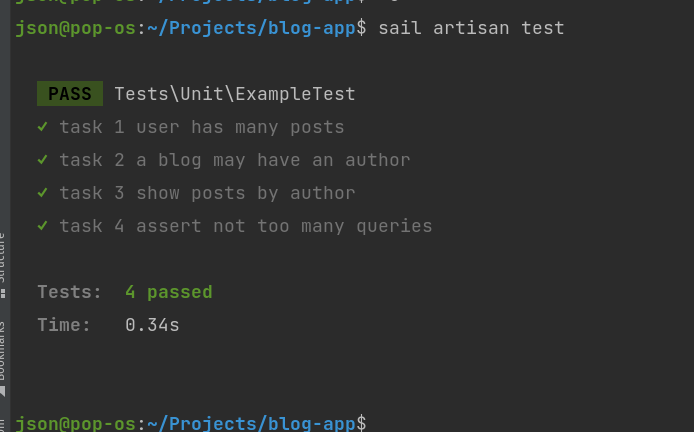

## Testing Outcome


## Example blog app

## Installation

Fork this repository

<a href="https://laravel.com/docs/9.x/installation#laravel-and-docker">Install docker desktop</a>

Copy .env.example to .env

```
cp .env.example .env
```

Build the docker containers using docker-compose
```
docker-compose up -d --build
```

Enter the app's container using

```cmd
docker exec -it blog-app-laravel.test-1 /bin/bash
```

Then inside the app's container run

```
composer install
npm install
php artisan key:generate
php artisan migrate 
```


## Tasks
Run the following inside the app container (blog-app-laravel.test-1)
```php
 php artisan test
```

Make changes in the code so the tests pass, you are not supposed to modify the tests.

## Run code in github actions

Alternatively if you have trouble installing docker locally you can run the tests using github actions.

To do this you need to go to your fork, Go to the `Actions` tab and enable workflows


After that every push you make to the `master` and `develop` branches will trigger
this [workflow](.github/workflows/build-and-run-tests.yml), that will build the app and execute the tests
